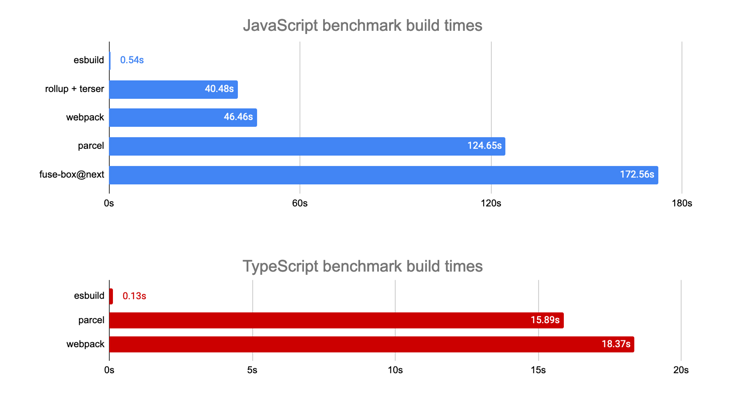

# polea `laya cmd编译工具`

# 介绍

```
 使用 esbuild 来增量构建 layabox 项目 修改代码后立即就能看到效果 提高开发速度，优化开发体验。
```

> ### 基于一下原因开发了这款工具
> 
> * 由于 Laya 官方提供的命里行工具不兼容 node 版本
> * 无法忍受 LayaAir 编译一次项目需要等待到50-70s 左右的时间
> ### 特性 
> * 使用 esBuild 加快编译速度
> * 高度可定制化（可以用于非 Laya 项目中）
> * 开箱即用

----------

## 关于 esBuild
- <a href="https://github.com/evanw/esbuild/">esbuild</a> 是一个用 Go 语言编写的用于打包，压缩 Javascript 代码的工具库。它最突出的特点就是速度极快，下图是 esbuild 跟 webpack, rollup, Parcel 等打包工具打包效率的一个比较:

  
  图片取自 <a href="https://github.com/evanw/esbuild/">esbuild Github 仓库</a>。
  
  为什么它能做到那么快？
  
    它是用 Go 语言编写的。
    该语言可以编译为本地代码解析，生成最终打包文件和生成 source maps 的操作全部完全并行化，无需昂贵的数据转换，只需很少的几步即可完成所有操作。
    该库以提高编译速度为编写代码时的第一原则，并尽量避免不必要的内存分配。
    更多详细介绍，详见 Breword 翻译的 <a href="https://www.breword.com/evanw-esbuild">esbuild 官方文档</a>;

## 对比其它工具

| 工具类型     |                       简介                       | 修改代码后需要等多久才能刷新浏览器并看到修改后的效果 | 是否支持断点调试 |   推荐度   |
| :----------- | :----------------------------------------------: | :--------------------------------------------------: | :--------------: | :--------: |
| layaAir      |                   手动点击编译                   |                      一年，很慢                      |      不支持      | 强烈不推荐 |
| layaair2-cmd |        跟第一步差不多，就是加了个自动编译        |                       半年，慢                       |       支持       |   不推荐   |
| webpack      | 自动编译，功能强大，但是项目比较大的话还是会很慢 |                      一天，稍快                      |       支持       |    推荐    |
| **本工具**   |        自动构建，不编译，项目再大都没影响        |  0秒，飞快，切换到浏览器刷新的速度有多快它就有多快   |       支持       |  强烈推荐  |


# 安装  `polea`
```shell
npm i -g polea
```


> 可以使用以下命令查看

```shell
polea -h
```

>> ---

# 使用 【初始化】

```
polea init 
```
> 命令执行后，会在项目目录下生成 `.polea` 文件夹
>
> .polea 目录下默认会生成两个 `config.*.ts/config.ts` 文件


>> ----

# 使用 【编译、发布】

> 制定自己的【编译/发布】流程请参考 config.ts和 config.polea.ts 这两个文件
> 
> 注意 其中 compile编译命令 可以替换成 publish 发布命令
```shell
polea compile               //执行的config.ts中的代码 
polea compile -p polea      //执行config.polea.ts中的代码
```

>> ------

# 使用 Watch

> 配置
```ts
buildConfig: (params: polea.ConfigCommand) => {
    let { command } = params;
    if (command == "compile") {//polea compile
        return {
            define: { DEBUG: true, RELEASE: false },
            watch: true,//开启监听模式
            output: "./bin",
            plugins: [new polea.ESBundlePlugin({ sourcemap: true })],
        };
    } else if (command == "publish") {//polea publish
        return {
            define: { DEBUG: true, RELEASE: false },
            watch: false,
            output: "./release/" + getversion(),
            plugins: [new polea.ESBundlePlugin({ sourcemap: false, minify: true })],
        };
    }
}
```

> ### 目前只有代码和资源监听两个插件支持,`目前发布命令不支持监听模式`

* ESBundlePlugin    //编译代码插件
* UIPlugin          //更新资源插件

# 插件

## 内置插件列表

> 如果需要自定义一个插件请参考`.polea/plugins`下的插件

|  插件名   | 说明  |
|  ----  | ----  |
| CleanPlugin  | 清理文件插件 |
| CompressJSPlugin  | 压缩 js 代码插件 |
| CopyPlugin  | 拷贝文件插件 |
| ESBundlePlugin  | 编译代码插件 |
| LayadccPlugin  | 生成 Layadcc 文件插件 |
| ManifestPlugin  | 生成版本信息 |
| UIPlugin  | 导出代码、导出ui、合成图片资源到 bin 目录下面 |

## 插件的使用

```ts
buildConfig: (params: polea.ConfigCommand) => {
    let { command } = params;
    if (command == "compile") {//polea compile
        return {
            //使用插件
            plugins: [
                new polea.UIPlugin(),//内置插件
                new polea.ESBundlePlugin({ sourcemap: true }),//内置插件
                new polea.CleanPlugin(),//内置插件
                new layadcc(`xxx`),//自定义的插件
            ],
        };
    } else if (command == "publish") {//polea publish
        return {};
    }
}
```
